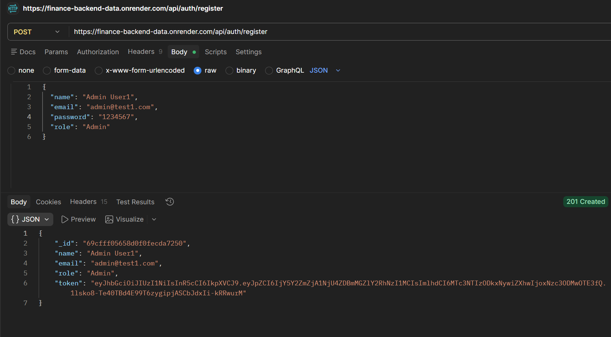
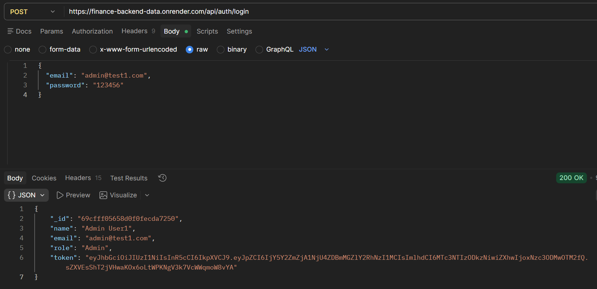
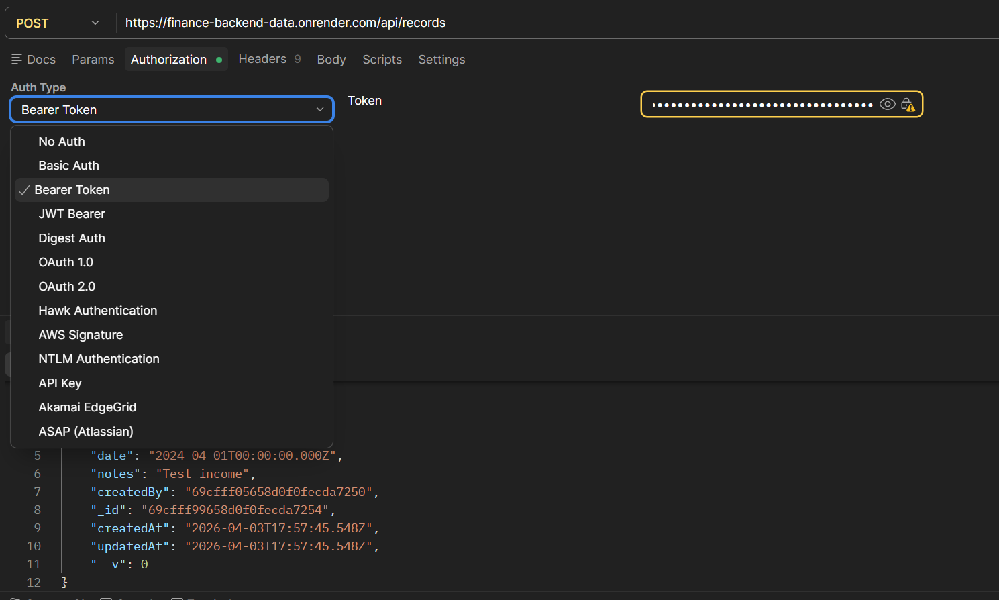

# Finance Dashboard Backend

A backend-only finance dashboard system built with Node.js, Express.js, and MongoDB.

🚀 **Live API Base URL:** [https://finance-backend-data.onrender.com](https://finance-backend-data.onrender.com)

💡 **How to Test:**  
Since this is a backend-only application, there is no graphical user interface. You can test the endpoints using Postman.
1. Download the included `Finance_Dashboard.postman_collection.json` file.
2. Import it into Postman.
3. The collection is already pre-configured to point to the live Render URL. Easily run endpoints by generating a Token via Register/Login first!

## API Testing Screenshots

Here are tests of the fully functioning backend APIs running perfectly on Postman:

**1. Register User** 


**2. Login User**


**3. Authorized User Creates Record** (Using Bearer Token)


## Features

- User & Role Management (Viewer, Analyst, Admin)
- JWT Authentication & Role-Based Access Control (RBAC)
- Financial Records Management (CRUD by Admin, Read by Viewers & Analysts)
- Dashboard Analytics (Income, Expenses, Net Balance, Category-wise, Monthly Summary)
- Pagination & Filtering for Records

## Setup Steps

1. **Clone the repository** (if not already cloned).
2. **Install dependencies**:
   ```bash
   npm install
   ```
3. **Environment Setup**:
   Ensure MongoDB is running locally on port `27017` or update the `MONGO_URI` in `.env`.
   Default `.env` configuration:
   ```env
   PORT=5000
   MONGO_URI=mongodb://127.0.0.1:27017/finance_dashboard
   JWT_SECRET=supersecretjwtkey_12345
   ```
4. **Start the server**:
   ```bash
   npm start
   # Or for development:
   npm run dev
   ```

## Roles

- **Viewer**: Read-only access to records.
- **Analyst**: Read and analytics access (Records + Dashboard).
- **Admin**: Full CRUD access for user management and records + Dashboard analytics.

---

## API Documentation

### Auth Routes

#### 1. Register User
- **Endpoint**: `/api/auth/register`
- **Method**: `POST`
- **Request Body**:
  ```json
  {
    "name": "Admin User",
    "email": "admin@example.com",
    "password": "password123",
    "role": "Admin"
  }
  ```
- **Response** (201 Created):
  ```json
  {
    "_id": "60d0fe4f5311236168a109ca",
    "name": "Admin User",
    "email": "admin@example.com",
    "role": "Admin",
    "token": "eyJhbGciOi..."
  }
  ```

#### 2. Login User
- **Endpoint**: `/api/auth/login`
- **Method**: `POST`
- **Request Body**:
  ```json
  {
    "email": "admin@example.com",
    "password": "password123"
  }
  ```
- **Response** (200 OK):
  ```json
  {
    "_id": "60d0fe4f5311236168a109ca",
    "name": "Admin User",
    "email": "admin@example.com",
    "role": "Admin",
    "token": "eyJhbGciOi..."
  }
  ```

#### 3. Update User Status / Role (Admin Only)
- **Endpoint**: `/api/auth/:id`
- **Method**: `PUT`
- **Headers**: `Authorization: Bearer <token>`
- **Request Body**:
  ```json
  {
    "status": "inactive",
    "role": "Viewer"
  }
  ```
- **Response** (200 OK):
  ```json
  {
    "_id": "60d0fe4f5311236168a109ca",
    "name": "User Name",
    "email": "user@example.com",
    "role": "Viewer",
    "status": "inactive"
  }
  ```

---

### Record Routes
*Requires valid JWT Token.*

#### 1. Create Record (Admin Only)
- **Endpoint**: `/api/records`
- **Method**: `POST`
- **Headers**: `Authorization: Bearer <admin_token>`
- **Request Body**:
  ```json
  {
    "amount": 1500,
    "type": "income",
    "category": "Salary",
    "date": "2023-10-01",
    "notes": "October Salary"
  }
  ```
- **Response** (201 Created): Returns generated record.

#### 2. Get Records (Viewer, Analyst, Admin)
- **Endpoint**: `/api/records`
- **Method**: `GET`
- **Query Params**: `type` (income/expense), `category`, `startDate`, `endDate`, `page`, `limit`
- **Headers**: `Authorization: Bearer <token>`
- **Response** (200 OK):
  ```json
  {
    "records": [...],
    "totalPages": 2,
    "currentPage": 1,
    "totalRecords": 15
  }
  ```

#### 3. Get Record by ID (Viewer, Analyst, Admin)
- **Endpoint**: `/api/records/:id`
- **Method**: `GET`
- **Headers**: `Authorization: Bearer <token>`

#### 4. Update Record (Admin Only)
- **Endpoint**: `/api/records/:id`
- **Method**: `PUT`
- **Headers**: `Authorization: Bearer <admin_token>`
- **Request Body**: Fields to update

#### 5. Delete Record (Admin Only)
- **Endpoint**: `/api/records/:id`
- **Method**: `DELETE`
- **Headers**: `Authorization: Bearer <admin_token>`

---

### Dashboard Routes
*Requires valid JWT Token.*

#### 1. Get Dashboard Summary (Analyst, Admin)
- **Endpoint**: `/api/dashboard/summary`
- **Method**: `GET`
- **Headers**: `Authorization: Bearer <token>`
- **Response** (200 OK):
  ```json
  {
    "totals": {
      "totalIncome": 5000,
      "totalExpenses": 2000,
      "netBalance": 3000
    },
    "categoryTotals": [
      { "category": "Salary", "type": "income", "total": 5000 },
      { "category": "Rent", "type": "expense", "total": 1000 }
    ],
    "recentTransactions": [...],
    "monthlySummary": {
      "2023-10": { "income": 5000, "expense": 1500, "net": 3500 }
    }
  }
  ```
